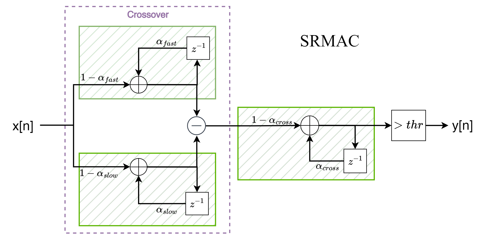
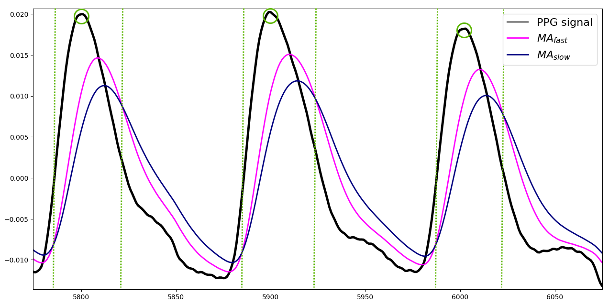

<b> SRMAC - Peak Detection for Photoplethysmography</b>

Photoplethysmography (PPG) is a non-invasive technique that measures changes in blood flow volume through optical means.
Accurate detection of peaks in the PPG waveform allows the extraction of the heart rate variability (HRV), a recognized indicator for the health of the cardiac and autonomic nervous systems.
Previous research has established the feasibility of PPG peak detection based on the crossover of moving averages.
This repository has sources to implement the Smoothed Recursive Moving Average Crossover (SRMAC) peak detector, which eliminates the need for post-processing and nonlinear pre-processing of previous crossover-based peak detectors
The proposed model is advantageous regarding memory and computational complexity, making it attractive for implementations on embedded devices.

Block diagram of the SRMAC peak detector.
 

  

Example of peak detection with SRMAC.
 

  

## Organization of the repository:

### Folders
<pre>
1) paper_plots                       - Scripts for image generation
2) ppg-dataset_husm                  - Dataset (.csv)
3) search_results                    - Results of the optimization processes (.npy)
</pre>

### Modules
<pre>
1) base_detector.py                  - Parent class for peak detectors
2) SRMAC_detector.py                 - The proposed Smooth Recursive Moving Average Crossover (SRMAC) detector
3) TERMA_detector.py                 - The TERMA detector, from the literature
4) optimization.py                   - Random search and grid search optimization
5) utilities.py                      - Signal processing utilities and confusion matrix extraction
6) read_datasets.py                  - Data reading functions
7) time_manager.py                   - Time managing
8) custom_confusion_matrix.py        - Custom confusion matrix for peak detection which has all four metrics (this is not currently used)
</pre>

### Scripts
<pre>
1) apply_SRMAC_detector.py                        - Example application of the SRMAC detector
2) apply_TERMA_detector.py                        - Example application of the TERMA detector
3) cross_validation_GS_TERMA.py                   - Extraction of cross-validation results for TERMA under grid search
4) cross_validation_GS_TERMA_parallel.py          - Parallel extraction of cross-validation results for TERMA under grid search
7) cross_validation_RS_TERMA.py                   - Extraction of cross-validation results for TERMA under random search
8) cross_validation_RS_TERMA_parallel.py          - Parallel extraction of cross-validation results for TERMA under random search
5) cross_validation_RS_SRMAC.py                   - Extraction of cross-validation results for SRMAC under random search
6) cross_validation_RS_SRMAC_parallel.py          - Parallel extraction of cross-validation results for SRMAC under random search
9) demonstrate_GS_TERMA.py                        - Demonstration of grid search for TERMA
11) demonstrate_RS_TERMA.py                       - Demonstration of random search for TERMA
10) demonstrate_RS_SRMAC.py                       - Demonstration of random search for SRMAC
12) per_protocol_phase_analysis.py                - Data analysis considering each protocol phase (rest, walk and recovery)

13) paper_plots/plot_ewma_bode.py                 - Plot magnitude x frequency for the EWMA filter
14) paper_plots/plot_ewma_impulse_response.py     - Plot the impulse response for the EWMA filter
15) paper_plots/plot_results.py                   - Plot per-subject results for both SRMAC and TERMA
16) paper_plots/read_results_GS_TERMA.py          - Plot per-subject results for a combination of peak detector and search method
17) paper_plots/read_results_RS_TERMA.py          - Plot per-subject results for a combination of peak detector and search method
18) paper_plots/read_results_RS_SRMAC.py          - Plot per-subject results for a combination of peak detector and search method
</pre>

If the <b>SRMAC model</b> is useful for your research or application, please cite it as

<pre>
@misc{machado2023srmac,
	title = {SRMAC -- Smoothed Recursive Moving Average Crossover for Real-Time Systolic Peak Detection in Photoplethysmography}, 
	author = {Cesar Abascal Machado and Victor O. Costa and Cesar Augusto Prior and Cesar Ramos Rodrigues},
	year = {2023},
	eprint = {2312.10013},
	archivePrefix = {arXiv},
	doi = {10.48550/arXiv.2312.10013}
	primaryClass = {eess.SP}
}
</pre>

If the <b>PPG dataset</b> is useful for your research or application, please cite it as

<pre>
@misc{machado2023HUSM
  author = {Abascal Machado, Cesar and O. Costa, Victor and Augusto Prior, Cesar and Ramos Rodrigues, Cesar and de Albuquerque, Isabella Martins and Schmidt Pasqualoto, Adriane},
  title = {HUSM and GMicro: PPG Peak detection dataset},
  doi = {10.5281/zenodo.8280127},
	year = {2023},
  howpublished= {\url{https://zenodo.org/}}
}
</pre>
